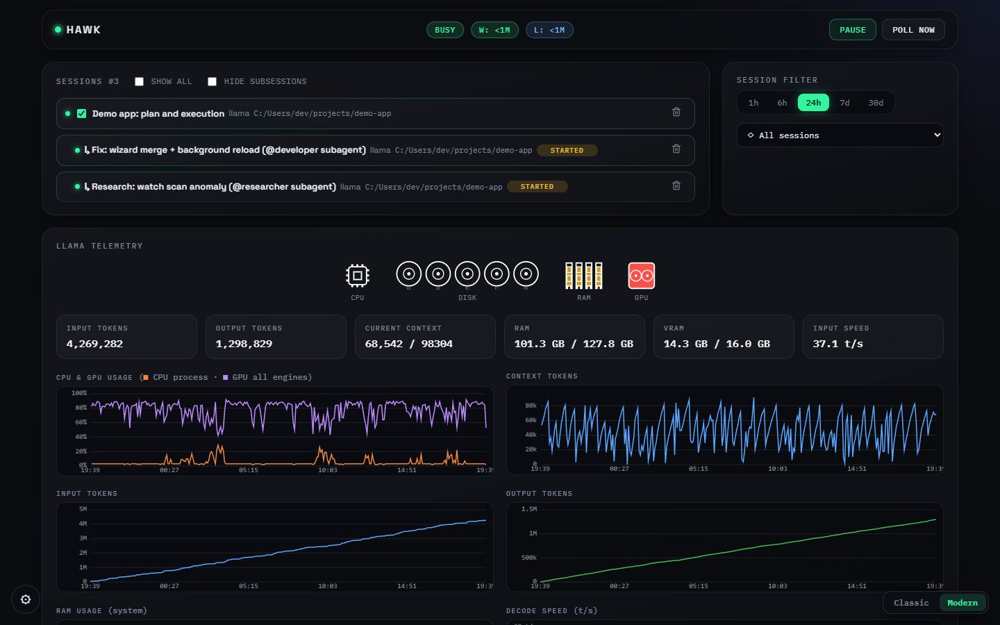
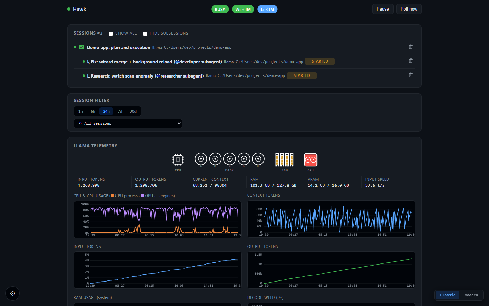

# Hawk

[](https://github.com/ChakraFusion/opencode-hawk/actions/workflows/tests.yml)

**A coordinator that keeps long-running local [OpenCode](https://opencode.ai) sessions moving while you're away.**

Local models running through llama.cpp are slow, and an agent working on a
multi-milestone build plan often stops: it finishes a step, waits for a
permission prompt, asks a question, or the model server degrades. Hawk watches
the session and nudges it along. It also pings your phone when a human is
actually needed.



<details>
<summary>Classic skin</summary>



</details>

## What it does

- **Auto-continue.** When the worker has stopped and the model is idle, Hawk
  injects a self-check prompt telling the agent to re-check the plan and keep
  going. It never interrupts a turn that is still generating, and sends at
  most one prompt per `re_stall_minutes`.
- **Confirmed finish.** The build counts as done only when the agent says
  `STOP: DONE` twice, on two separate messages. Hawk asks once to confirm.
- **Permissions and questions.** It auto-accepts external-directory permission
  prompts and answers question-tool prompts (choosing the "(Recommended)"
  option) for sessions you mark as monitored.
- **llama-server watchdog.** It detects a dead or degraded `llama-server`
  (low decode speed at deep context) and restarts it.
- **Phone alerts via [ntfy](https://ntfy.sh).** Escalations and plan-complete
  events go to your phone, and replies from the ntfy app are routed back into
  the session.
- **Dashboard.** A local web UI (`http://127.0.0.1:8765`) with sessions, events,
  token speed, GPU/VRAM charts, the ntfy channel and settings.

## Requirements

- **Windows 10/11.** GPU and process probes and the desktop restart use Windows APIs.
- **Python 3.10+** and `psutil` (`pip install -r requirements.txt`)
- **OpenCode**, either the Desktop app or the CLI. Hawk reads its session database
  (default `~/.local/share/opencode/opencode.db`, override with `OPENCODE_DB`).
- **Optional:** a local `llama-server` (llama.cpp) for the idle and degradation
  probes and the watchdog. Defaults to port 1234.
- **Optional:** the [ntfy app](https://ntfy.sh) on your phone.

## Quick start

```bat
git clone https://github.com/ChakraFusion/opencode-hawk.git
cd opencode-hawk
quickstart.bat
```

On the first run, `quickstart.bat` creates `config.json` from
`config.example.json` and generates a **private ntfy topic** for this install
(`hawk-` followed by 12 random digits). Then:

1. Open `config.json` and set `project_dir` to the repository your agent works in.
2. Subscribe to the printed topic in the ntfy app. Treat the topic name like a
   password: anyone who knows it can read and send messages on it.
3. Run `quickstart.bat` again. It starts the monitor and the dashboard in two
   windows and opens the dashboard in your browser.

`quick_kill.bat` stops both.

Manual start:

```bat
python coordinator.py --monitor --interval 3
python dashboard.py --port 8765 --open
```

Other modes: `coordinator.py --once` (single pass, e.g. from Task Scheduler),
`--dry-run` (print the verdict without acting), `--install-task` (print a
`schtasks` command), and `--self-test`.

## Configuration

Everything lives in `config.json`. Most timing settings can also be changed
from the dashboard.

| Key | Default | Meaning |
|---|---|---|
| `project_dir` | `""` | Repository the agent works in (used for git and commit checks) |
| `session_id` | `""` | Session to watch; empty = newest llama.cpp session |
| `monitored_sessions` | `{}` | Per-session switches: `enabled`, `auto_accept`, `auto_continue`, `project_dir` |
| `idle_minutes` | `8` | Quiet time before a session counts as stopped |
| `poll_minutes` | `10` | Monitor interval (overridden by `--interval`) |
| `stalled_turn_minutes` | `15` | An unfinished turn silent this long counts as stopped |
| `re_stall_minutes` | `45` | Minimum gap between self-check prompts for one session |
| `continue_message` / `done_confirm_message` | built-in | The prompts Hawk injects |
| `auto_accept_external_dirs` | `true` | Auto-accept external-directory permission prompts (monitored sessions only) |
| `auto_answer_questions` | `true` | Auto-answer question-tool prompts |
| `continue_via_attach` | `true` | Inject through the Desktop sidecar so the GUI streams live |
| `restart_desktop_before_continue` / `desktop_exe` | `false` / `""` | Restart OpenCode Desktop before continuing |
| `llama_api_port` | `1234` | llama-server API port |
| `llama_pid` | `0` | 0 = find llama-server by process name |
| `gpu_vram_total_mb` | `0` | VRAM shown in charts; 0 = auto-detect |
| `notify.ntfy.topic` | generated | Your private ntfy topic |
| `notify.ntfy.server` | `https://ntfy.sh` | ntfy server (self-hosted works too) |
| `notify.ntfy.kinds` | `escalation, plan_done, test` | Which events are pushed to the phone |

Environment variables: `COORD_HOME` (folder for config and state; default is
the script folder), `OPENCODE_DB`, `OPENCODE_BIN`.

## Agent markers

Hawk's injected prompts tell the agent which markers to use, so normally no
extra setup is needed:

| Marker | Meaning |
|---|---|
| `STOP: DONE` | The whole plan is complete (Hawk asks once to confirm) |
| `STOP: NEEDS_DECISION ...` | A human decision is needed |
| `STOP: BLOCKED ...` | A problem the agent cannot solve alone |

## Privacy

Hawk runs locally. The dashboard binds to `127.0.0.1`. The only outbound
traffic is to your ntfy server, and only if a topic is configured.

## Tests

```bat
python coordinator.py --self-test
python dashboard.py --self-test
python selftest_notify.py
```

## License

[MIT](LICENSE) © ChakraFusion
